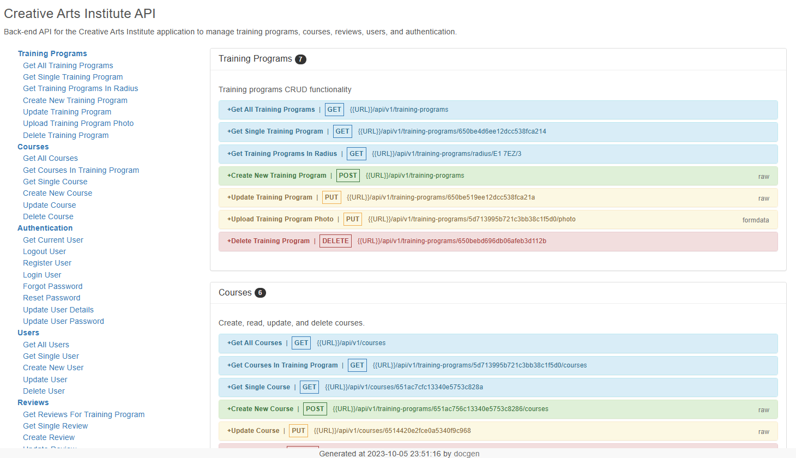

# Creative Arts Institute API

Back-end only API for a art course directory website. Provides full CRUD functionality for training programs, courses, reviews, and users, and uses JSON Web Tokens for authenticaton.

## Table of contents

- [Overview](#overview)
  - [Features](#features)
  - [Screenshot](#screenshot)
  - [Links](#links)
- [Development](#development)
  - [Technologies](#technologies)
- [Usage](#usage)
  - [Making requests](#making-requests)
  - [Build app](#build-app)
- [Future development](#future-development)
- [Contact & Socials](#contact)
- [Acknowledgements](#acknowledgements)

## Overview

### Features

This API has the following features:

- Handles full CRUD operations on programs, courses, reviews, and users
- Provides search results within radius based on postcodes
- Handles the ability to upload, update, and delete images
- Stores JSON Web Token in cookies to authenticate users
- Sends password reset tokens via email using Mailtrap
- Protects, authenticates, and checks ownership of user roles for each route
- Encrypts passwords and reset tokens using encryption packages
- Prevents NoSQL injections, cross site scripting, and HTTP paramter pollution
- Adds additional security headers by default with the helmet package
- Adds rate limiting of 100 requests per 10 minutes
- Uses cors to make the API public

### Screenshot



### Links

- Creative Arts Institute API documentation: [https://creative-arts-institute-api.onrender.com/](https://creative-arts-institute-api.onrender.com/)

_Note that free instance types on Render will spin down with inactivity. Please allow a few minutes for the live site to load._

## Development

### Technologies

- [Node.js](https://nodejs.org/en) - JavaScript environment
- [Express](http://expressjs.com/) - Web framework for Node
- [MongoDB Atlas](https://www.mongodb.com/atlas) - NoSQL database in the cloud
- [Mongoose](https://mongoosejs.com/) - Object modelling for MongoDB data
- [Postman](https://www.postman.com/) - API testing & workspace environment
- [Render](https://render.com/) - Hosting & deployment

## Usage

### Making requests

Make requests to the API using the following URL pattern. Please refer to the documentation to see each available request in more detail.

```
https://creative-arts-institute-api.onrender.com/api/v1/<resource>
```

Requests are limited to 100 per 10 minute window. Requests exeecing this limit will respond with a timeout.

### Build app

Rename the "configenv" file in the config folder to "config.env" and update the values/settings appropiately.

#### Install dependencies

```
npm install
```

#### Run app

```
npm run dev       // Run in development
npm run start     // Run in production
```

## Future development

- Currently emails are stored in a Mailtrap test account, so will not reach a users inbox. Email delivery platform will be moved over to Sendgrid in future.

- There is no front-end solution for the API. A front-end website for this API is considered for development.

## Contact

- Website - [morganba.net](morganba.net)
- GitHub - [@morganbanet](https://github.com/morganbanet)
- Twitter - [@morganbanet](https://twitter.com/morganbanet)

Please refer to my [GitHub](https://gist.github.com/morganbanet) to find find my contact email.

## Acknowledgements

This is a course based project from Brad Traversy's [Node.js API Masterclass With Express & MongoDB](https://www.udemy.com/course/nodejs-api-masterclass/) course on Udemy. The course has allowed to build APIs like this one. If you are interested in learning how to build your own APIs, please take a look at his course.
